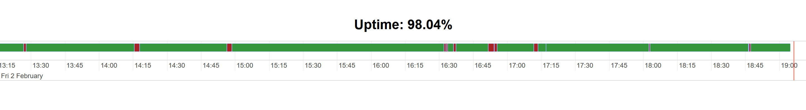

# ISPbane

ISPbane is a tool that you can use to monitor your internet connection.

## Usage

* Build the project using `cargo build --release`
* Run the project using `./target/release/ispbane`
* Open your browser and navigate to `http://localhost:5000`

ISPbane will send a HTTP GET request to `http://ismycomputeron.com/` every 5 seconds and keep track of the request succeeding or failing in the file `data.json`.

## TODOs
* Add configuration for port, URL, interval
* Facelift the UI
* Add more statistics, like request duration, etc.
* Add CI and docker image